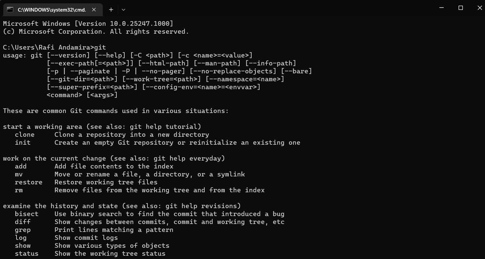
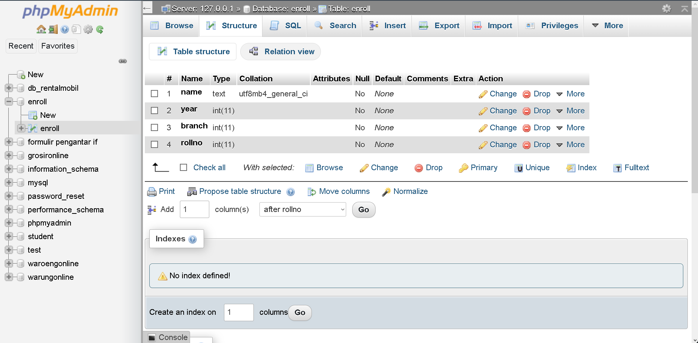
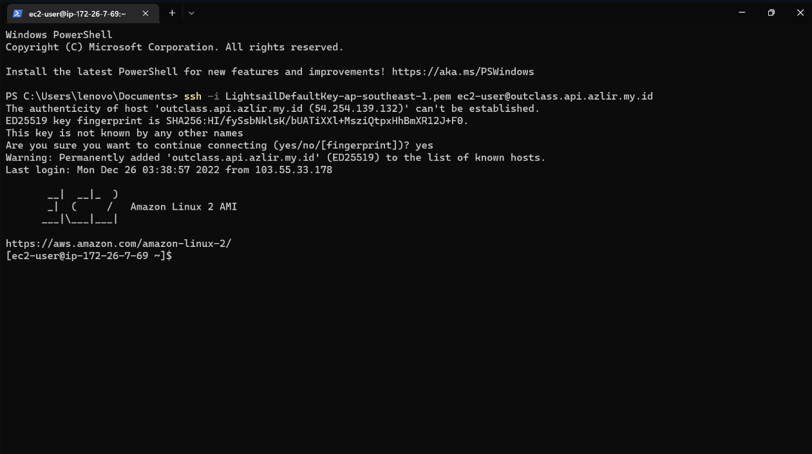
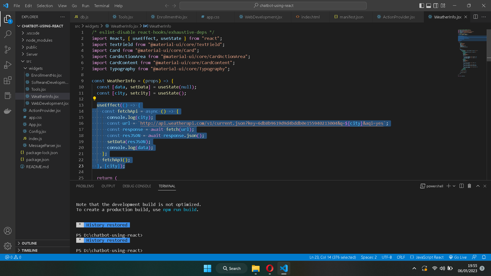
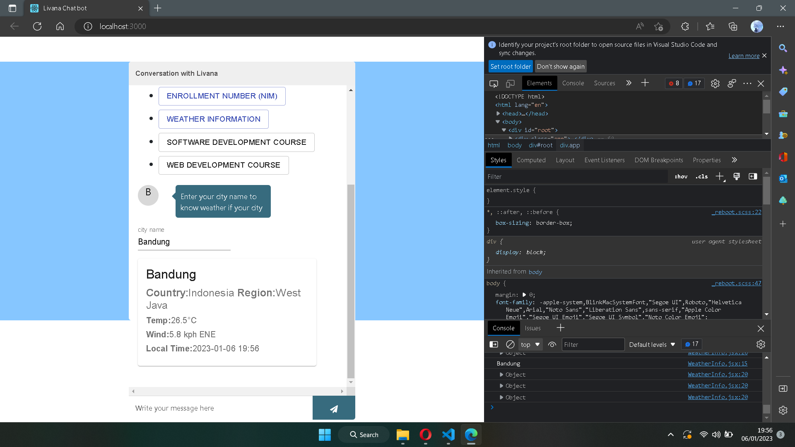

# UAS Rafi Andamira

## Capaian Perkuliahan

Klik simbol ▶ (panah) untuk membuka konten.

### CLO-0211

Demo: Git Installation

Demo : PostgreSQL / MySQL installation

<i>Saya menggunakan MySQL.</i>

Demo : MobaXterm installation & SSH connection

Demo : NodeJS & NPM installation, operation & hello world

### CLO-0212

Demo : Browser API - Event Handling, Using Fetch/Axios

### CLO-0213

Demo : HTML Responsive Layout with Bootstrap

